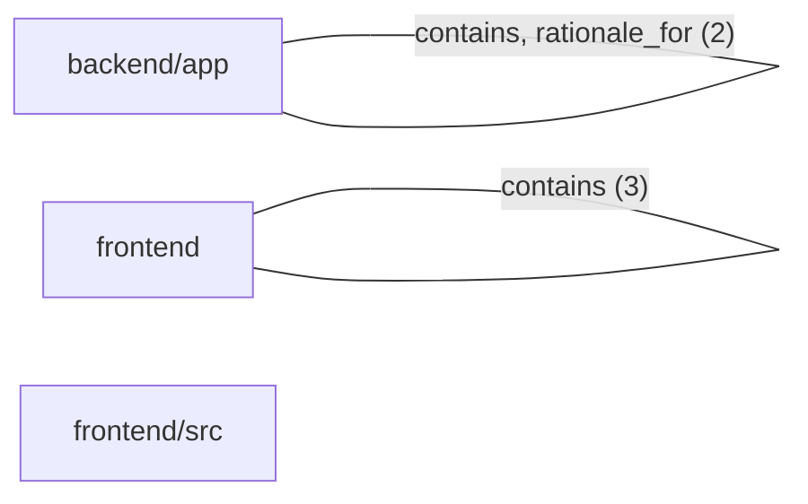

# DreamMagnet/test_demo Architecture

Repository: DreamMagnet/test_demo
Branch: main
Viewed commit: 000bc8b81e051c1b1d497a96adcdced28d6d5516
Graph commit: 000bc8b81e051c1b1d497a96adcdced28d6d5516
Snapshot status: current

## Project Context

Created with CodeAtlas

Source graph: graphify-out/graph.json
Source graph SHA-256: c8647d132025f8dc0978adb372db2a7a21b66f24b740f87bba7fe57f42e4d616
Inventory: 3 modules, 4 files, 9 symbols, 5 connections.

## Module Connections

## Module Inventory

| Module | Source files | Symbols |
| --- | --- | --- |
| backend/app | backend/app/__init__.py, backend/app/main.py | 4 |
| frontend | frontend/package.json | 4 |
| frontend/src | frontend/src/main.js | 1 |

## Symbol Inventory

| ID | Symbol | Kind | Source file | Source location | Description |
| --- | --- | --- | --- | --- | --- |
| backend_app_main_main | main() | symbol | backend/app/main.py | L4 |  |
| frontend_package | package.json | symbol | frontend/package.json | L1 |  |
| frontend_package_name | name | symbol | frontend/package.json | L2 |  |
| frontend_package_private | private | symbol | frontend/package.json | L4 |  |
| frontend_package_version | version | symbol | frontend/package.json | L3 |  |
| backend_app_main | main.py | symbol | backend/app/main.py | L1 |  |
| backend_app_main_rationale_1 | Application entry point. | symbol | backend/app/main.py | L1 |  |
| backend_app_init | __init__.py | symbol | backend/app/__init__.py | L1 |  |
| frontend_src_main | main.js | symbol | frontend/src/main.js | L1 |  |

## Recorded Connections

| Source ID | Source file | Relationship | Target ID | Target file |
| --- | --- | --- | --- | --- |
| backend_app_main | backend/app/main.py | contains | backend_app_main_main | backend/app/main.py |
| frontend_package | frontend/package.json | contains | frontend_package_name | frontend/package.json |
| frontend_package | frontend/package.json | contains | frontend_package_version | frontend/package.json |
| frontend_package | frontend/package.json | contains | frontend_package_private | frontend/package.json |
| backend_app_main_rationale_1 | backend/app/main.py | rationale_for | backend_app_main | backend/app/main.py |

## Repository Documentation

### README.md

# test_demo

Scaffolded by CodeAtlas as a both project.

### graphify-out/GRAPH_REPORT.md

# Graph Report - test_demo  (2026-09-15)

## Corpus Check
- cluster-only mode — file stats not available

## Summary
- 9 nodes · 5 edges · 4 communities (1 shown, 1 thin omitted)
- Extraction: 100% EXTRACTED · 0% INFERRED · 0% AMBIGUOUS
- Token cost: 0 input · 0 output

## Graph Freshness
- Built from commit: `50b9b460`
- Run `git rev-parse HEAD` and compare to check if the graph is stale.
- Run `graphify update .` after code changes (no API cost).

## Community Hubs (Navigation)
- Community 0
- Community 1

## God Nodes (most connected - your core abstractions)
1. `private` - 1 edges
2. `Application entry point.` - 1 edges

## Surprising Connections (you probably didn't know these)
- None detected - all connections are within the same source files.

## Import Cycles
- None detected.

## Communities (4 total, 1 thin omitted)

### Community 0 - "Community 0"
Cohesion: 0.50
Nodes (3): name, private, version

## Knowledge Gaps
- **3 isolated node(s):** `name`, `private`, `version`
  These have ≤1 connection - possible missing edges or undocumented components. (Counts symbols only; 7 node(s) total have ≤1 connection when file, concept and rationale nodes are included.)
- **1 thin communities (<3 nodes) omitted from report** — run `graphify query` to explore isolated nodes.

## Suggested Questions
_Questions this graph is uniquely positioned to answer:_

- **What connects `name`, `private`, `version` to the rest of the system?**
  _3 weakly-connected nodes found - possible documentation gaps or missing edges._

## Evidence and Coverage

Module boundaries are source folders, not inferred deployment boundaries. The diagram preserves recorded graph connections; it does not establish runtime behavior.
Connection direction is not verified by the source graph.
- This snapshot does not declare directed edges; connection direction is not verified.
- Coverage is limited to the committed graph and documents. Undocumented runtime services and connections are not inferred.

Repository documents are source material. Validate architecture claims against the source files at the viewed commit.
